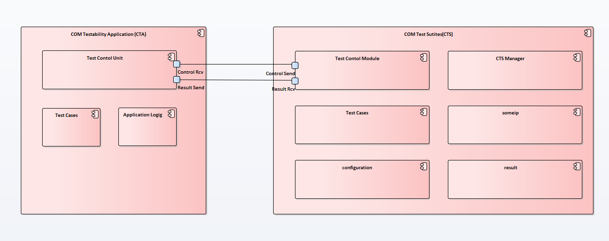
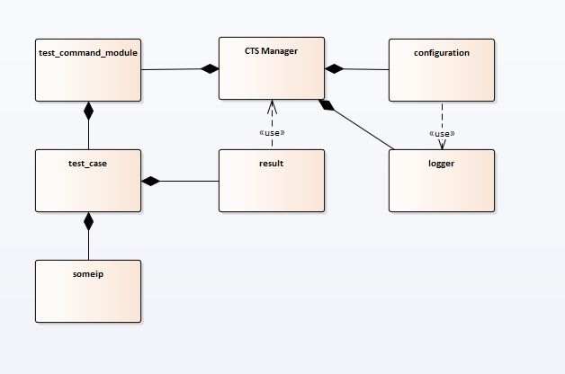

# COM Test Suites (CTS)
To verify and integrate AUTOSAR COM function cluster, CTS help you robust S/W quality automatically and manually. 
CTS and CTA (COM Testability App) are connected each other to communicate for running test scenarios. 
Following figure shows CTS and CTA component view point. Each modules send and receive control message and result for 
result of test scenarios.

## **Object**
CTS has 3 main points for testing AUTOSAR COM functional cluster.
   * Improve S/W quality and stability
   * Verify suitable AUTOSAR COM requirements
   * Reduce human errors in the workspaces

## **Version**
|Version|Date (y/m/d)|Contents|Author|
|:-------:|:--------:|:----------------------------------------------------------------:|:-----------------------------------------------:|
|0.1|20.11.15|Initial Update CTS| youngho27.kim@lge.com |
|0.2|20.12.15|Add Communication with CTA| youngho27.kim@lge.com jinyoung87.kim@lge.com 	|

## Component View
Following figure shows that component view of CTS.

### CTS Manager

### Configuration
### Test Command Module
### Test Case
### Someip
### Result
### Logger

## **How to Use**
### Automatically test with jenkins
* Automatically test with Daily build
* Automatically test with git message(commit)
* Manually run by Engineers

## **Action Items**
* Comformance Test will be added to verify SOME/IP Daemon, SOMEIP/IP protocoal
